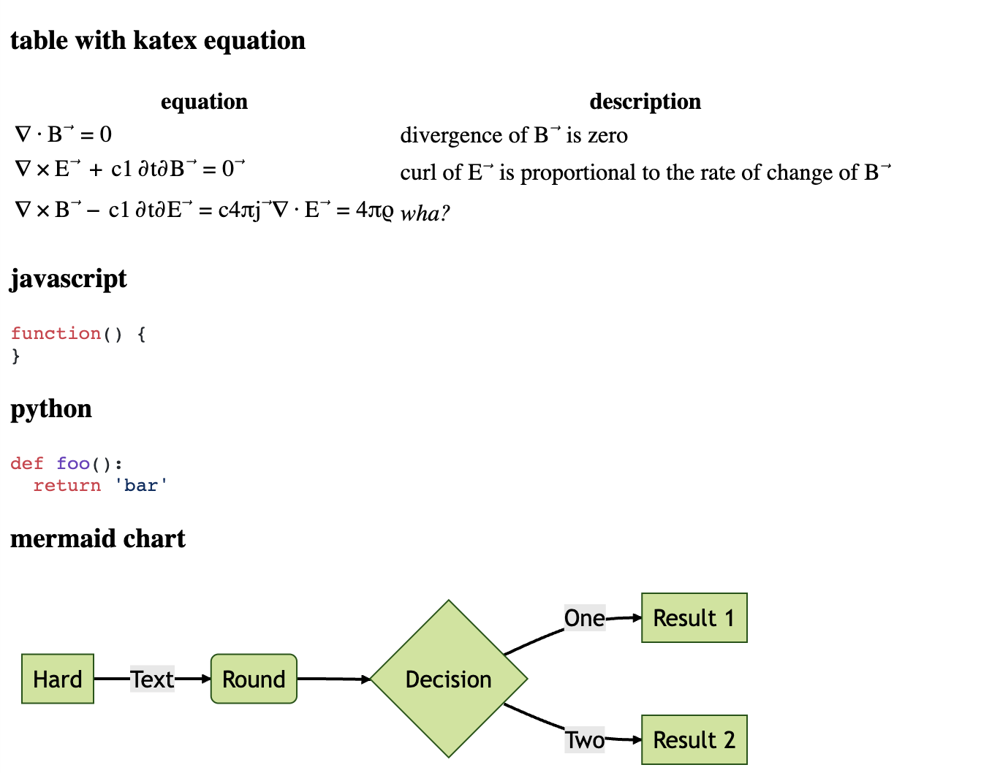

# Text editor
* markdown-it
* katex 
* mermaid
* highlight-js  

TODO:
* prosemirror 



### Development
```npm run dev```

starts server hosted on port
```localhost:1234```

### Production
``npm run prod``

### mermaid workaround
TODO: use as submodule
build mermaid from repository ```https://github.com/vane/mermaid``` branch ```parcel-build```  
copy ```cp -r dist rtt-markdown/mermaid/```
